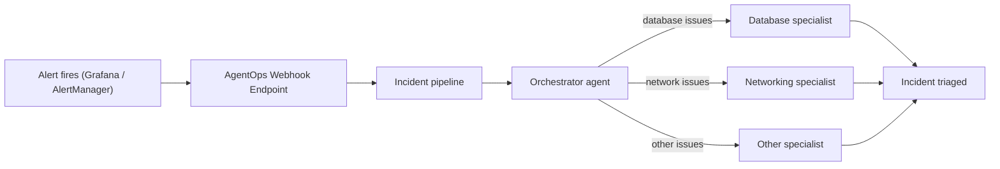

# Incident pipeline (Terraform)

A **self-contained AgentOps incident-response pipeline**, stood up from scratch with Terraform —
no pre-existing IDs required. Alerts POST to a webhook, matching ones become **incidents**, and an
**orchestrator** agent investigates by delegating to **specialist** agents.

## Files

```
examples/resources/agentops_incident_pipeline/
  main.tf              provider + inputs (api_key, endpoint, specialist_llm_key)
  resource.tf          the whole stack — 6 resources, wired together
  outputs.tf           webhook url/token, ids, and a copy-paste `how_to_test`
  alerting/            connect Grafana / Prometheus AlertManager to the webhook
```



## What it creates

| Piece | What it is |
| --- | --- |
| **Orchestrator agent** | Required — every incident goes through it. It's the delegation agent: it triages the alert, picks the right specialists, and fans parallel tasks out to them. |
| **Specialists** (database, networking) | Focused agents the orchestrator delegates parallel tasks to. The **database specialist** investigates database-related problems; the **networking specialist** investigates network-related ones — swap or add your own. |
| **Webhook trigger** | The endpoint your alerts POST to. |
| **Incident pipeline** | The glue — it routes matching alerts (here: `severity=critical` in `staging`) to the orchestrator. |
| **LLM credential** | The API key the specialists use for their model (default `claude-sonnet-5`). |

In `resource.tf` these are the `agentops_*` resources, already wired together.

## What happens when an alert fires

1. Your monitor POSTs the alert to the webhook.
2. If it matches the routing rule (`severity=critical`, `env=staging`), it becomes an incident.
3. The orchestrator triages it, then delegates parallel tasks to the right specialists.
4. Findings are attached and the incident is marked triaged — with an optional Slack summary.

Re-firing the same alert updates the existing incident instead of starting a new investigation.

## Prerequisites

- **An AgentOps API key.** Go to [agentops.komodor.com](https://agentops.komodor.com) → log in →
  **Settings → API Key**, and create either a **Personal Access Token (PAT)** or a **Service Account**
  token. Export it as `AGENTOPS_API_KEY` (or pass `-var api_key=…`).
- **An LLM key for the specialists** (`specialist_llm_key`) matching their `model` — the default
  `claude-sonnet-5` needs an **Anthropic** key. Using a different provider? Set `model` on the
  specialists to that provider's model and pass its key instead. **Already have agents deployed?** You
  can skip this and the specialist resources entirely — see [Reuse existing agents](#reuse-existing-agents-optional).

## Quick start

```bash
export AGENTOPS_API_KEY="…"          # PAT or Service Account token from Settings → API Key
terraform init
terraform apply -var specialist_llm_key="sk-ant-…"   # match the key to the specialists' model
```

Target staging or a self-hosted control plane with `-var endpoint=https://staging.agentops.komodor.com`
(or `AGENTOPS_ENDPOINT`). The provider is `komodorio/agentops`.

## Reuse existing agents (optional)

Instead of letting Terraform create the specialists (and their LLM credential), you can bind agents
you already run. Find their IDs in the AgentOps UI: [agentops.komodor.com](https://agentops.komodor.com)
→ **Agents** (the Fleet list) → open an agent → copy its ID from the detail page. Then drop the
`agentops_credential` + `agentops_hosted_agent` resources and reference the IDs directly:

```hcl
specialist_bindings = [
  { agent_id = "<agent-id-from-ui>", role = "database", enabled = true },
  { agent_id = "<agent-id-from-ui>", role = "networking", enabled = true },
]
```

The same applies to `orchestrator_binding.agent_id`. When you do this, `specialist_llm_key` is no
longer required — those agents already carry their own credentials.

## Test it

After `apply`, the `how_to_test` output prints a ready-to-run `curl` that fires an alert matching the
routing rule. In short:

```bash
TOKEN=$(terraform output -raw incident_webhook_token)
curl -sS -X POST "$(terraform output -raw incident_webhook_url)" \
  -H "X-Webhook-Token: $TOKEN" \
  -H "Content-Type: application/json" \
  -d '{
    "status": "firing",
    "labels": { "alertname": "HighErrorRate", "env": "staging", "severity": "critical" },
    "annotations": { "description": "Error rate exceeded threshold on checkout-service" },
    "fingerprint": "test-'"$(date +%s)"'"
  }'
```

Expect **HTTP 202**, then check `/incidents` in the AgentOps UI. `401` = wrong token; `202` but no
incident = the labels didn't match the routing rule. Use a fresh `fingerprint` each time — re-firing
the same one updates the incident but does not dispatch a new orchestrator run.

## Next steps

- **Connect a real alert source** — point Grafana or Prometheus AlertManager at the webhook:
  see [`alerting/README.md`](alerting/README.md).
- **Modify the example** (routing rule, specialists, provider, environment): run the
  [`terraform-incident-pipeline`](../../../.claude/skills/terraform-incident-pipeline/SKILL.md) skill.
- **Wire up alerting** with an assistant: run the
  [`connect-alerting-webhook`](../../../.claude/skills/connect-alerting-webhook/SKILL.md) skill.
